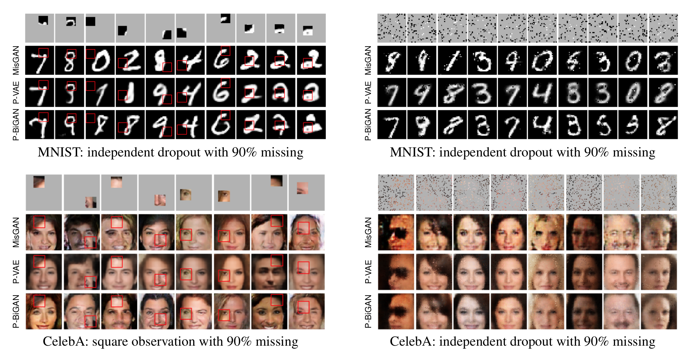
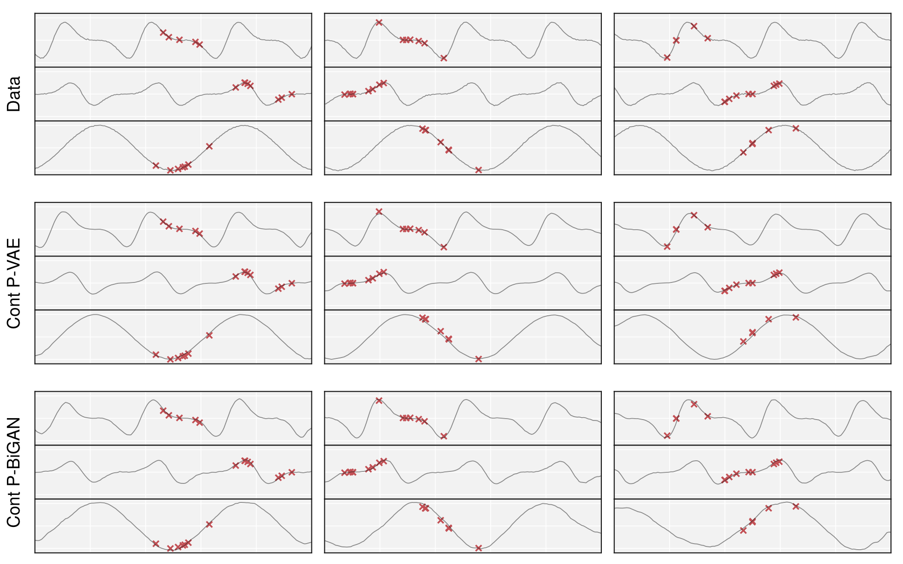

# Learning from Irregularly-Sampled Time Series: A Missing Data Perspective

This repository provides a PyTorch implementation of the paper
["Learning from Irregularly-Sampled Time Series: A Missing Data Perspective"](https://arxiv.org/abs/2008.07599).


## Requirements

This repository requires Python 3.6 or later.
The file [requirements.txt](requirements.txt) contains the full list of
required Python modules and their version that we tested on.
To install requirements:

```sh
pip install -r requirements.txt
```


## Image



### MNIST

Under the `image` directory, the following commands train P-VAE and P-BiGAN for
incomplete MNIST:

```sh
# P-VAE:
python mnist_pvae.py
# P-BiGAN:
python mnist_pbigan.py
```

### CelebA

For CelebA, you need to download the dataset from its
[website](http://mmlab.ie.cuhk.edu.hk/projects/CelebA.html)
by doing either of the following:
* Download the file `img_align_celeba.zip` from [this link](https://drive.google.com/uc?export=download&id=0B7EVK8r0v71pZjFTYXZWM3FlRnM)
  and extract the zip file into the directory `image/celeba-data`, or
* Run the script [download-celeba.sh](image/celeba-data/download-celeba.sh)
  under the directory `image/celeba-data`. Make sure you have
  [curl](https://curl.haxx.se) on your system.

  ```sh
  cd image/celeba-data && bash download-celeba.sh
  ```

Under the `image` directory, the following commands train P-VAE and P-BiGAN for
incomplete CelebA:
```sh
# P-VAE:
python celeba_pvae.py
# P-BiGAN:
python celeba_pbigan.py
```

### Command-line options

For both MNIST and CelebA scripts, use the option
`--mask block --block-len n` to specify the mask to be n by n blocks.
`--mask indep --obs-prob .2` to specify the mask to be independent dropout
with 80% missing pixels.

Use `-h` to see all the available command-line options for each script
(also for the scripts for time series described below).

## Time Series

Our implementation takes as input a time series dataset in a format
composed of three tensors `time`, `data`, `mask` saved as numpy's
[npz](https://numpy.org/doc/stable/reference/generated/numpy.savez_compressed.html) file.
For a time series of `N` data cases, each of which has `C` channels
with each channel having at most `L` observations (time-value pairs),
it is represented by three tensors `time`, `data` and `mask`
of size `(N, C, L)`:

* `mask` is the binary mask indicating which entries in `time` and `data`
  correspond to a missing value.
  `mask[n, c, k]` is 1 if the `k`-th entry of the `c`-th channel of the
  `n`-th time series is observed, and 0 if it is missing.
* `time` stores the timestamps of the time series rescaled to the range [0, 1].
  Note that for those missing entries, whose corresponding
  `mask` entry is zero, they must be set to values within [0, 1]
  for the decoder to work correctly.
  The easiest way is to set those to 0 by `time *= mask`.
* `data` stores the corresponding time series values associated with `time`.
  For those missing entries, they may contain arbitrary values.


The script [gen_toy_data.py](time-series/gen_toy_data.py) is an example
of creating a synthetic time series dataset in such format.

### Synthetic data



Under the `time-series` directory, the following commands train a P-VAE
and P-BiGAN on a synthetic multivariate time series dataset:

```sh
# P-VAE:
python toy_pvae.py
# P-BiGAN:
python toy_pbigan.py
```

### MIMIC-III

MIMIC-III can be downloaded following the instructions from
its [website](https://mimic.physionet.org/gettingstarted/access/).

For the experiments, we apply the optional preprocessing
used in [this work](https://github.com/mlds-lab/interp-net)
to the MIMIC-III dataset.

For time series classification task, our implementation takes as input
one of the following three labeled time series data format:

1. Unsplit format with an additional label vector with the following 4 fields.
   The data will be randomly split into train/test/validation set.
    * `(time|data|mask)`: numpy array of shape `(N, C, L)` as described before.
    * `y`: binary label of shape `(N,)`.
2. Data come with train/test split with the following 8 fields.
   The training set will be
   subsequently split into a smaller training set (80%)
   and a validation set (20%).
    * `(train|test)_(time|data|mask)`
    * `(train|test)_label`
3. Data come with train/test/validation split with the following 12 fields.
   This is useful for model selection based on the metric evaluated
   on the validation set with multiple runs (with different randomness).
    * `(train|test|val)_(time|data|mask)`
    * `(train|test|val)_label`

The function `split_data` in [time_series.py](time-series/time_series.py)
demonstrates how the data file is read and split
into training/test/validation set.
You can follow this to create time series data of your own.

Once the time series data is ready,
run the following command under the `time-series` directory:

```sh
# P-VAE:
python mimic3_pvae.py
# P-BiGAN:
python mimic3_pbigan.py
```

## Citation

If you find our work relevant to your research, please cite:

```bibtex
@InProceedings{li2020learning,
  title     = {Learning from Irregularly-Sampled Time Series: A Missing Data Perspective},
  author    = {Li, Steven Cheng-Xian and Marlin, Benjamin M.},
  booktitle = {Proceedings of the 37th International Conference on Machine Learning},
  year      = {2020}
}
```

## Contact

Your feedback would be greatly appreciated!
Reach us at <li.stevecx@gmail.com>.
